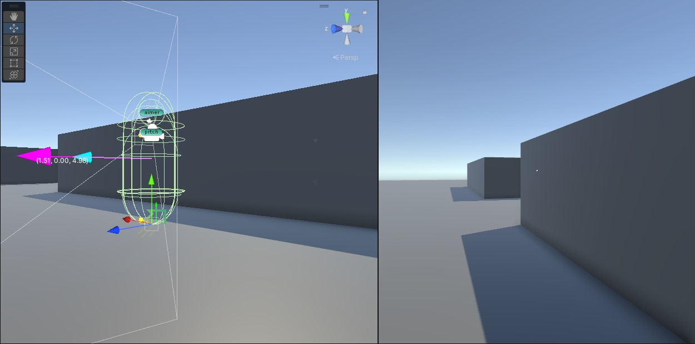

# Game - one click Assets
### Unity assets for quick start
Unity does lack of many builtin systems.
The alternatives are generally overblown with complexity, trying to be a universal fit.
So here is the stuff that could be imported simply by adding a git url and created with just right click.
While these assets are the outcome of prototyping phases, they could serve their purpose in medium complexity projects.

## Requirements
- Unity 2021.3

## List of assets
### 1. First Person Character Controller
> https://github.com/amelkor/Game.git?path=/Assets/BSR/CharacterController

Create by right click on scene/inspector _Game->Simple First Person Controller_

_note: currently requires com.unity.inputsystem being exactly 1.3.0 due to unresolved bugs in their 1.4 versions_
